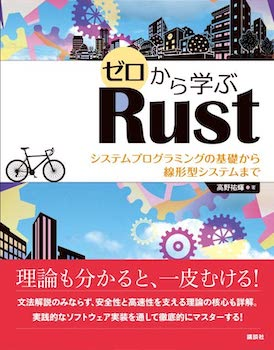

# ゼロから学ぶRust システムプログラミングの基礎から線形型システム

著: 高野祐輝、出版社: 講談社、出版日: 2022年12月15日

## 各章のソースコード

- [第1章 環境構築とHello, world!](./ch01/)
- [第2章 Rustの基本](./ch02/)
- [第3章 所有権・ライフタイム・借用](./ch03/)
- [第4章 トレイト](./ch04/)
- [第5章 モジュール・ドキュメント・テスト](./ch05/)
- [第6章 正規表現](./ch06/)
- [第7章 シェル](./ch07/)
- [第8章 デバッガ](./ch08/)
- [第9章 線形型システム](./ch09/)

## 正誤表

[正誤表](./errata.md)のページを参照ください。
Pull RequestおよびIssueで誤植、誤りを報告いただけます。

## ソースコードのライセンス

ソースコードは、[MITライセンス](./LICENSE)で利用が可能です。
商用の如何に関わらず再頒布・改変可能ですが、再頒布時に著作権とライセンスの表記が必要です。ソースコード利用に関して、著作権者はいかなる責任も負いません。
